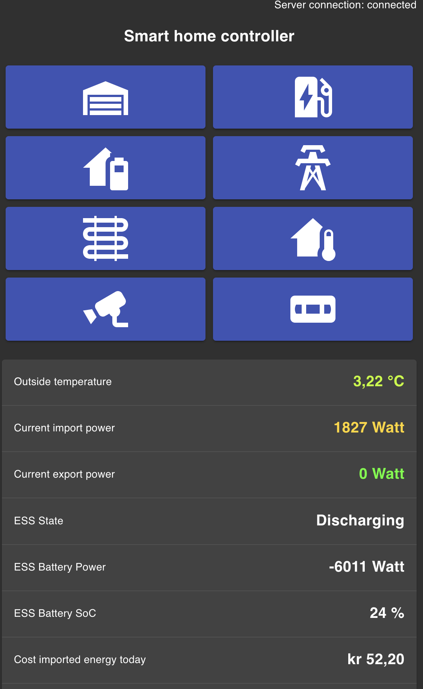

# SmartHomeServer
Smarthome backend and frontend

### Features:
- Management of [Victron](https://www.victronenergy.com/) ESS system, [using mode 3](https://www.victronenergy.com/live/ess:ess_mode_2_and_3)
- Management of my DehneEVSE Charging stations (See [hardware](https://github.com/sebdehne/DehneEVSE-Hardware) and [firmware](https://github.com/sebdehne/DehneEVSE-Firmware)) 
  - Charge only when energy prices are low (overrideable)
  - Intelligent load sharing between multiple stations
  - Dynamically adjust the charging rate to stay below house power-budget (I get billed by power consumption)
  - Logging of all parameters, incl. power consumption to InfluxDB
- Heating control
  - Heat only when energy prices are low
  - Keep certain temperature
  - Logging of all parameters to InfluxDB
- Garage door
  - Auto closing after a configurable timeout
  - Logging of all parameters to InfluxDB
- Temperature, humidity & light sensor logging to InfluxDB
- Read data from electricity meter (via "[HAN-port](https://www.nek.no/info-ams-han-utviklere/)") and log all data to InfluxDB 
- Camera live viewer using WebRTC (via [RTSPtoWebRTC](https://github.com/deepch/RTSPtoWebRTC))

### Frontend:
- React frontend
- material UI styring
- WebSockets for real time updates

### Backend:
- pure Kotlin - no Spring
- Jetty / WebSockets
